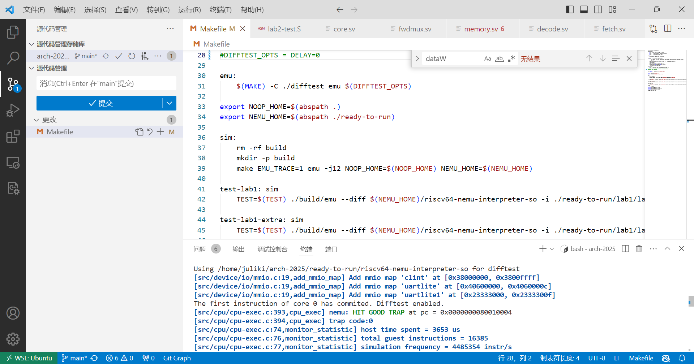
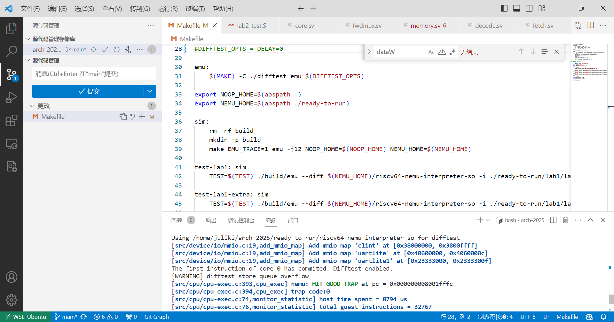
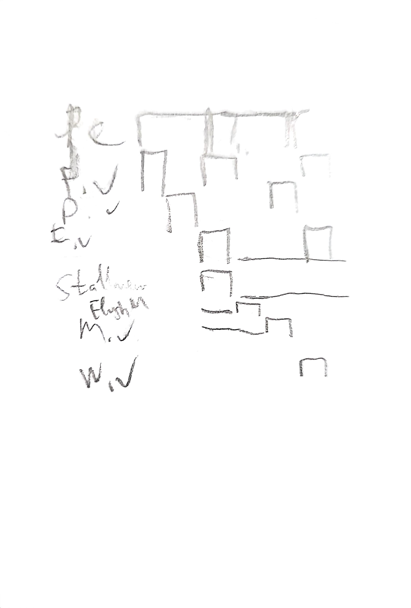
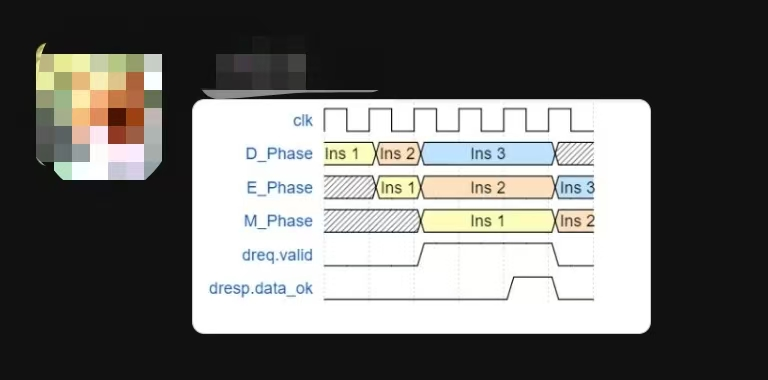

# Arch-2025-Lab2 实验报告

## 访存指令与冒险处理

### 23307130064 周弈成

## 内容简介

在根据五级流水线框架构成的、实现了基本运算指令的多周期CPU（没有冒险处理的CPU不能称为流水线）的基础上，构建能够运行访存指令并处理冒险情况的流水线架构CPU。实现的指令有：

* 读存指令：ld, lb, lh, lw, lbu, lhu, lwu
* 写存指令：sd, sb, sh, sw
* 长立即数指令：lui

## 实验结果

能够通过lab1和lab2的随机化测试，均显示“HIT GOOD TRAP”。

* 随机化lab1结果
* 随机化lab2结果

## 文件结构变化

`/pipeline`文件夹内文件结构有变化：

* `fwdmux.sv`：新建转发用模块，调用`fwd.sv`判断能否转发后，根据两种转发类型结果确定两个转发值；
* `fwd.sv`：新建转发用模块，判断给定的数据dst和src能否满足转发条件；
* `/decode/signext20.sv`：新增扩展模块，为lui指令（和auipc指令）符号扩展长立即数；
* `/fetch/decoder.sv`：因为load-use阻塞需要，decoder提前至fetch阶段，从`/decode/decoder.sv`移动。

此外，修改下列文件：

* `/src/core.sv`：增添阻塞，调用转发模块（具体于下文介绍）；
* `/include/pipes.sv`：重构解码类型格式，增添新增指令类型解码值，在控制信号中增加访存信号，添加转发专用类型；
* `/pipeline/fetch/fetch.sv`：增添解码功能和相应格式；
* `/pipeline/decode/decode.sv`：删去解码功能，仅保留寄存器功能，增添load-use阻塞的bubble；
* `/pipeline/execute/execute.sv`：增添对接转发数据的译码器，传递写内存结果；
* `/pipeline/memory/memory.sv`：增添访存过程（具体于下文介绍）；
* `/pipeline/writeback/writeback.sv`：对接memory阶段，修改valid在接受空指令时为空以忽略bubble；
* `/pipeline/regfile/regfile.sv`：修正输出寄存器状态为上一周期REG，与提交的上一周期指令dataW相符；
* `/pipeline/decode/sigext12.sv`：修改变量名，适配lui扩展；
* `/pipeline/execute/alu.sv`：（未使用）增添部分其他运算，已注释掉。

## 转发设计

由于修改了difftest发射信号的周期，lab1测试无法通过，考虑课上讲述的转发设计。

有两种转发需求：第一类转发是前一指令对后一指令，需将execute阶段的运算结果aluout转发至当前指令execute之前；第二类转发是前一指令对再后一指令，需将memory阶段确定的写入寄存器结果（可以是运算或读内存结果）writedata转发至当前指令execute之前。其中，第一类转发可以覆盖第二类转发。

在转发时，需要满足的条件是：后指令源寄存器为前指令目的寄存器，且不为零寄存器；前指令有写寄存器的操作。由于存在阻塞bubble，在转发时还需要确认两条指令是否为因延迟导致的同一指令。

根据转发性质选择接受哪一类转发，并把转发结果传入execute阶段。

在execute阶段，判断是否有必要启用转发结果。由于转发结果来自寄存器，所以在部分指令中会被立即数或者pc覆盖。

初步实现转发后，通过了lab1，后续修改后，通过了lab2。

## 访存流程

实现转发后，需要为新指令实现访存流程。需要根据指令表，设计相应解码值和控制信号，设计memory模块的访存流程，并实现访存期间的流程阻塞。

memory模块需要实现发起访存请求dreq和接收访存结果dresp的功能。其中，为避免重复发送访存请求，需要在接收到结果后清除当前访存请求，所以采用时序逻辑；接收访存结果的功能用组合逻辑实现。

访存请求由使能、地址、大小、写入数据、写入掩码模式组成；访存结果由两个使能和读取数据组成。由于访存地址对齐到`0x8`，且访存指令要求字节数多样，访存请求的后两者和访存结果的读取数据需要特殊处理：

* 首先处理访存地址对齐前的偏移量，保存为地址偏移量；
* 地址偏移量零扩展为64位后，乘8（左移3位），保存为字节偏移量；
* 根据字节偏移量，左移写入数据的相应位数；
* 根据指令要求，确定写入掩码位数，并左移地址偏移量；
* 接收访存请求后，先需要把得到的数据右移字节偏移量位，再根据指令类型做两种位扩展选其一，存入流水线寄存器。

访存请求过程中，需要阻塞流水线除写回外的阶段，到访存请求完成时，则需要强制刷新其他阶段。为此，设置专用阻塞逻辑：

* 当访存请求存在且访存结果未返回时，阻塞；
* 由于访存阻塞的时序逻辑延迟，需要在接收需要访存的控制信号（写内存或读内存）时立即开始阻塞；
* 当阻塞完成时，强制刷新，在core中采用时序逻辑记录上次访存阻塞结果并判断与此次不同来代表强制刷新。

正确处理访存请求后，可以通过部分lab2的测试，检查完其他部分后，可以完全通过。

## load-use阻塞

上句指令为写内存指令时，若下句使用到了此句的寄存器目的地址作为数据源，因为在下句执行过程前上句的访存过程未完成，无法通过转发方式传递数据，需要添加bubble阻塞。

为此，在取指阶段和译码阶段增加相应判断，以阻塞取指阶段来添加bubble空指令。

添加bubble通过把此次取指到的指令和控制信号改为空值实现。这类全空指令不提交至difftest。

实现阻塞后，可以通过lab2的大部分测试，检查完其他部分后，可以完全通过。

## 实验过程

本次实验耗时较长，过程曲折。

先完成了转发部分框架，但是此时观察波形图，发现各个指令间有一个周期的气泡，把dataM转发改为dataW转发后通过了lab1，未注意此处存在结构性问题。

结果在构建访存部分阻塞时，由于执行阶段此时未完成，无法通过常规方式保持各阶段同步进行，CPU死机。

* 抓狂的本人试图在未解决问题时手绘波形图解决阻塞问题

排查原因，发现是未接收请求指令结果时没有阻塞流水线，导致实际执行单位为半周期（一个clk上升沿）；实际上，为保持每周期同步执行，各阶段应各延迟半个周期，由pc阻塞信号控制。

* 某位热心同学在助教基础上给出的理想波形图

实现后，可以同步进行各阶段，且可以正常实现访存阻塞，波形图符合预期。然后实现load-use阻塞。

实现后，发现有较靠后的读内存指令出错。排除了地址与流水线相关故障后，猜测是先前对同一地址写入的内存数据有误。发现先前编写的转发模块对于即将写入内存的寄存器值未生效，修改后，可以通过。
