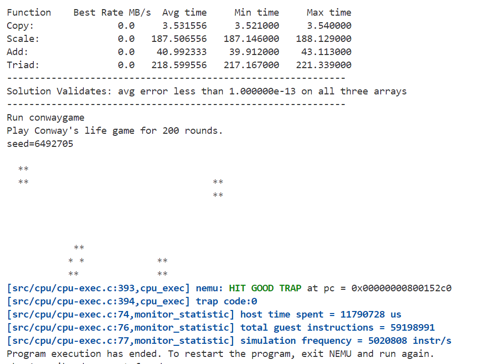
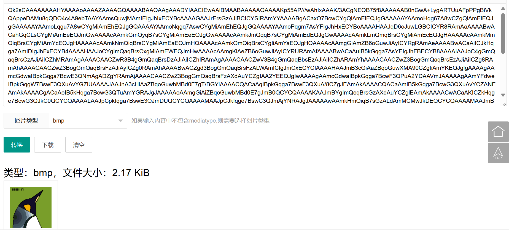
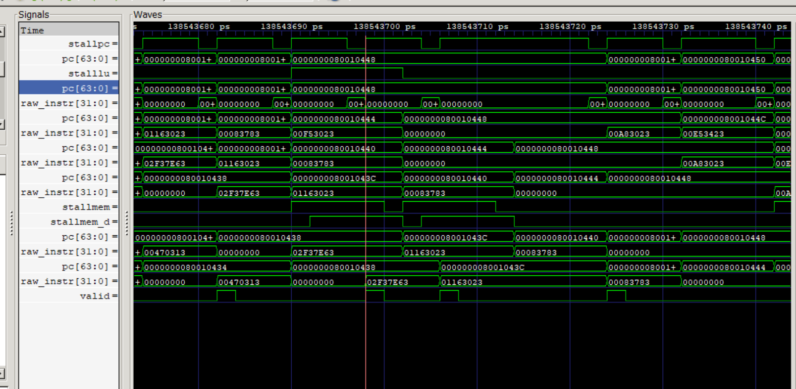
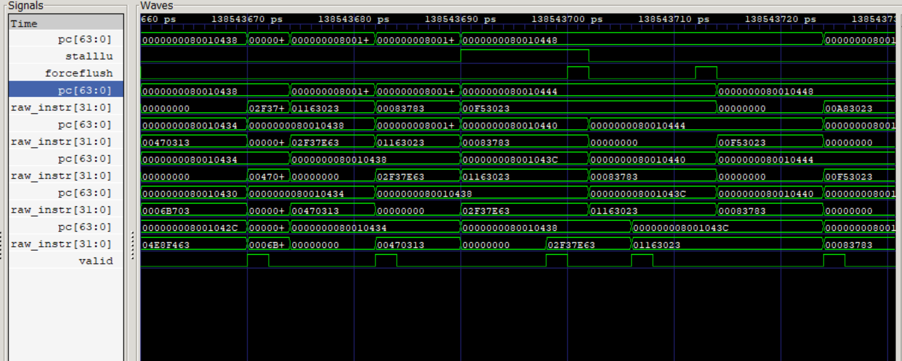

# Arch-2025-Lab3 实验报告

## 跳转指令与更多的运算类型

### 23307130064 周弈成

## 内容简介

在根据五级流水线框架构成的、实现了基本运算和访存指令的流水线CPU的基础上，构建支持移位与置位运算和分支跳转指令的流水线架构CPU。实现的指令有：

* 运算指令：sll(i)(w), srl(i)(w), sra(i)(w), slt(i)(u)
* 长立即数指令：auipc
* 分支与跳转指令：beq, bne, blt(u), bge(u), jal, jalr

## 实验结果

能够通过lab3的所有测试，显示“HIT GOOD TRAP”。

* 测试结果
* 彩蛋：鸣谢交学长

## 文件结构变化

`/pipeline`文件夹内文件结构有变化：

* 将`/decode/`中与`/fetch/decoder.sv`有关的模块迁移到`/fetch/`中；
* `/fetch/shamtzeroext.sv`：新增扩展模块，为移位运算指令零扩展移位立即数，统一格式；
* `/execute/branch.sv`：新增分支判断模块，判断是否满足跳转条件，实现与ALU相似；
* `/fetch/pcselect.sv`不再使用。

此外，修改下列文件：

* `/src/core.sv`：
  * 更改pc类型，统一为word_t；
  * 修正寄存器接口名称；
  * 增添分支跳转用阻塞；
  * 修复load-use阻塞；
  * 按格式修正提交内容。
* `/include/pipes.sv`：增添新增指令类型解码值，在控制信号中增加分支判断函数类型与跳转专用信号；
* `/pipeline/fetch/fetch.sv`：更改添加气泡的功能实现，增添气泡接口；
* `/pipeline/fetch/decoder.sv`：增添新增解码情况与立即数种类；
* `/pipeline/decode/decode.sv`：更改添加气泡的功能实现，增添气泡接口；
* `/pipeline/execute/execute.sv`：
  * 增添调用分支判断的模块；
  * 增添是否分支与分支目标的输出接口。
* `/pipeline/execute/alu.sv`：修正了增添的部分其他运算，并启用；
* `/pipeline/memory/memory.sv`：修正写寄存器值条件，仅regwrite为真时写入值；
* `/pipeline/writeback/writeback.sv`：简化逻辑。

## 移位及置位运算设计细节

由于移位与置位运算中，w指令与一般指令差别较大，分别设计ALU函数。
在不同的移位函数中，截取相应位数并进行运算。
对于w指令，仅对后32位运算，简单将前32位零扩展后，接入已有的符号位扩展模块重新扩展调整。
SystemVerilog提供`>>>`操作符实现算术右移，而常规的右移操作符`>>`为逻辑右移。
运算时，需要特别标注是否为有符号数（默认无符号），采用SystemVerilog提供的`$signed()`和`$unsigned()`函数实现。

## 分支与跳转设计

由于分支与跳转均需要完成相似的“计算pc增加值后跳转”，可以把二者流程统一处理。
跳转指令有两个计算部分：一个是计算pc增加值，一个是判断是否跳转。而原有的执行阶段设计中仅一个ALU运算模块，无法满足需求，所以需合理安排两种运算的实现，并新增运算模块。
由于跳转指令需要不同的比较模式，不能简单通过已有运算实现，所以决定为判断是否跳转专门设计模块，而计算pc增加值的运算则由ALU实现。

计算pc增加值过程：

* 设置ALU函数为加法；
* 利用原有控制信号，设置srcb为立即数；
* 新设计控制信号，指定srca为pc。

设计跳转条件：

* **不跳转**：除bxx和jal、jalr指令外的所有指令，保证跳转使能为0；特别地，若pc跳转值与原有需去的pc值（pc+4）相同，也不跳转；
* **无条件跳转**：跳转指令如jal与jalr，直接设置跳转使能为1；
* **条件跳转**：bxx指令，根据比较结果设置跳转使能。

跳转模块输入两个比较寄存器，根据以上条件比较，设置使能。

执行模块输出跳转目标地址与跳转使能。

有跳转目标地址且跳转使能为1时，需要设置核心中下一时钟周期的pc值为跳转目标，否则为pc+4。但是，由于跳转需要在执行阶段判断，前两个阶段（取指和译码）已经执行到pc+4和pc+8，若需要跳转，则须把这两个阶段的错误指令改为bubble。为此，在这两个阶段的模块中，设置专门用来表示bubble的接口。bubble状态下，指令值和控制信号均置空。

由于ireq的访存延迟，需要把跳转使能和跳转地址用时序寄存器**延迟一个周期**输入pc和相应模块，才能正常传递跳转信息。

## 其他细节修正

### 立即数位数细节

对于B-type指令，立即数虽为12位，但是其实际使用时是13位（末位恒为0）；类似的，J-type指令立即数为20位，实际使用时是21位（末位恒为0）。对于两种情况，有不同的处理方式。

由于有现成的12位立即数符号位扩展模块，对于B-type指令，可以先直接使用，再左移一位。
现成的20位立即数符号位扩展模块专为U-type指令设计，自带左移12位的功能，若直接使用，会丢失符号信息。所以，对于J-type指令，根据规则拼合出立即数，直接完成符号位扩展和左移。

### load-use阻塞修正

在lab3中，有相比lab2更苛刻的访存样例，位于pc值0x8001043c-0x80010448处：

```riscv
sd x17,0(x12)
ld x15,0(x16)
sd x15,0(x10)
sd x10,0(x16)
```

可以发现，第二句指令ld与第三句指令sd发生了load-use冲突，需要添加bubble，但是判断这两句冲突的同时，第一句sd处于访存阶段的阻塞期间，而在lab2中，有设计“一旦访存完成，所有访存阶段前的指令均需要立即刷新”。这会导致即将进入译码阶段的第三句pc对应的指令是bubble，而同时取指阶段已被刷新为第四句sd指令，所以第三句指令在提交中消失了。
（如下波形图中，0x80010444处指令丢失）

为此规定：在“访存完毕立即刷新”信号和load-use阻塞信号同时存在时，取指阶段不刷新，其他阶段刷新。这样，取指阶段就不会刷新为第四句指令，而是在提交完一遍第三句指令的bubble后，再次提交正确的第三句指令。
（如下波形图中，可看到0x80010444处指令不丢失，pc延迟）


## 实验过程

本次实验实际用时不长，由于本人失手重装系统，导致拖慢了进度。
环境重新配置完成后，首先完成了分支操作，然后修正了运算指令设计（无符号数），再检查跳转指令的立即数设置，最后完成了load-use阻塞修正。
