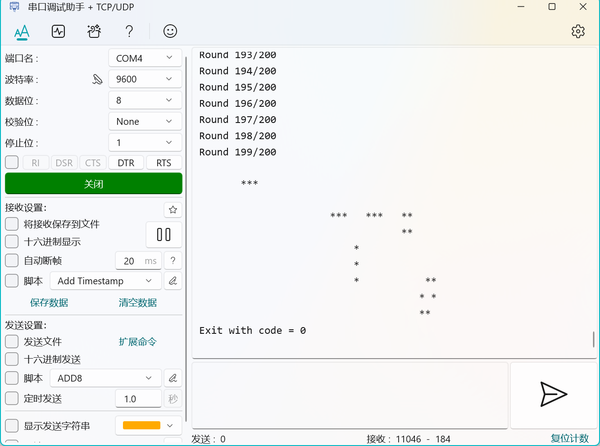

# Arch-2025-Lab4 实验报告

## 控制状态寄存器和开发板实验

### 23307130064 周弈成

## 内容简介

在根据五级流水线框架构成的、实现了完整的运算、访存、分支指令的流水线CPU的基础上，增添控制状态寄存器（CSR）和相关指令。实现的功能有：

* 控制状态寄存器：mstatus、mtvec、mip、mie、mscratch、mcause、mtval、mepc、mcycle、mhartid、satp
* 控制状态寄存器指令：CSRRW(I)、CSRRS(I)、CSRRC(I)

此外，将实现的CPU仿真后连接到开发板进行测试。

## 实验结果

能够通过lab4的所有测试，显示“HIT GOOD TRAP”。

* 测试结果

仿真上板能够通过lab3的所有测试。

* 测试结果

## 文件结构变化

`/pipeline`文件夹内文件结构有变化：

* `/fetch/`中：删去冗余的位扩展模块和不再使用的PC选择模块；
* 删去`/regfile/`文件夹，`regfile.sv`迁移到`/decode/`。
* 添加控制状态寄存器模块`/decode/csrfile.sv`：
  * 存放控制状态寄存器；
  * 提供读取和写入接口；
  * 根据读取地址和写入地址解码，实现读写。

此外，修改下列文件：

* `/src/core.sv`：
  * 添加CSR，接入difftest；
  * 更新分支跳转用阻塞逻辑（下文详述）。
* `/include/pipes.sv`：增添CSR和CSR指令类型解码值，以及新的ALU运算解码值，在数据类型中添加CSR读取和写入数据；
* `/pipeline/fetch/decoder.sv`：
  * 增添CSR解码情况；
  * 简化立即数扩展，直接在各情况中计算。
* `/pipeline/decode/decode.sv`：增添接入CSR寄存器模块的读写接口，相应修改数据类型；
* `/pipeline/execute/execute.sv`：
  * 添加为CSR指令设置的特殊分支判断；
  * 增添是否分支与分支目标的输出接口。
* `/pipeline/execute/alu.sv`：增添并启用CSR指令相关运算；
* `/pipeline/fetch/fetch.sv`、`/pipeline/memory/memory.sv`、`/pipeline/writeback/writeback.sv`：添加CSR相关数据输出。

## CSR寄存器的作用

* mstatus寄存器用于控制CPU的运行状态，包括中断、异常、访存、分支等。
* mtvec寄存器用于存放异常处理程序的地址。
* mip寄存器用于存放中断请求和异常请求。
* mie寄存器用于控制中断和异常的使能。
* mscratch寄存器用于存放临时数据。
* mcause寄存器用于存放异常原因。
* mtval寄存器用于存放异常地址。
* mepc寄存器用于存放异常处理程序的地址。
* mcycle寄存器用于存放CPU的时钟周期数。
* mhartid寄存器用于存放CPU的ID。
* satp寄存器用于存放虚拟地址空间的地址。

## CSR指令的数据路径

CSR类指令解析后，产生一个CSR地址，一个目的寄存器，以及立即数或一个源寄存器。
由于ALU设计中立即数位于第二输入值的位置，我们将CSR作为ALU的第一输入值，可能的另一个源寄存器使用第二输入值位置。

为方便CSR相关的运算，ALU增添了两个运算功能（直接用或运算实现CSR读后置位的功能）：

* （对应CSR读后写）取其中一个值（仅取第二个值的功能启用）；
* （对应CSR读后清除）将第二个值取反后，和第一个值取与。

需要写回两个值：一个是写回CSR地址的运算结果，另一个是写入寄存器地址的原有CSR值；
两个值跟随数据寄存器传递（CSR地址也需要跟随传递），分别接入寄存器模块写回即可。

## 修正跳转设计并实现执行CSR指令后刷新

CSR指令执行后需要**刷新流水线**，**以保证随后的程序在正常状态下执行**。

由于跳转模块设计中也有相似的刷新流水线需求，所以我们可以直接复用跳转模块的刷新流水线功能。
这需要我们从当前指令“跳转“到下一个指令，即pc+4。

但是，上次实验中对于“pc跳转值与原有需去的pc值（pc+4）相同”的情况不执行跳转；并且由于实现细节问题，去除此特殊判断后程序会有重复执行的出错。
为此，需要修复相应的实现细节：

* 上次实验中设计了两种在取指和译码添加气泡的条件：
  
  * 采用：有跳转且取指-译码阶段pc值不为跳转pc值；
  * 未采用：有跳转且核心中pc值不为跳转pc值；

* 我们发现，跳转时一定需要添加气泡，与各个阶段pc值是否为跳转pc值无关；
* 因此尝试改为跳转时直接在取指和译码两个阶段添加气泡，并删除上述特殊判断；
* 可以通过lab3。

修复冗余气泡条件后，设计中复用跳转的功能也可以实现：

* 在跳转判断模块中添加“如果是CSR指令，直接跳转”；
* 在执行阶段，若执行的是CSR指令，设置跳转目标为pc+4。

以上方法可以实现CSR指令的刷新流水线功能，能够通过lab4的所有测试。

## 上板测试实验

首先，测试接口，将开发板连到电脑上。接口工具可以正常接收信号，但是Vivado无法识别开发板。安装Digilent驱动并重启后，可以识别。

然后，由于使用2019.2版本的Vivado，修改ip核和工程文件版本号。顺利完成仿真和生成数据流过程，无报错。将生成的bitstream文件烧录到开发板上。

通过开发板运行lab3测试，执行过程中，开发板上的led灯闪烁，说明开发板正常运行。接口测试工具可以显示程序执行过程并正常退出，实验成功。
