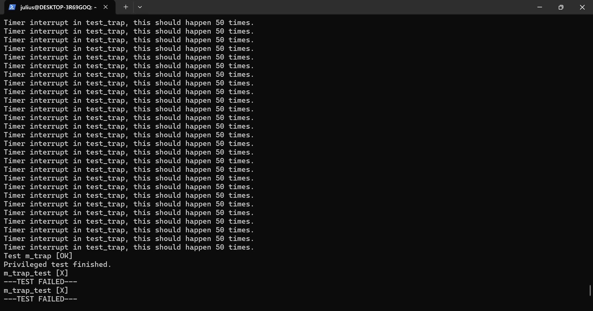

# Arch-2025-Lab6 实验报告

## 中断与异常

### 23307130064 周弈成

## 内容简介

在根据五级流水线框架构成的、实现了完整的运算、访存、分支指令与控制状态寄存器以及MMU的流水线CPU的基础上，实现常见的中断和异常。实现的功能有：

* 异常：指令地址不对齐、数据地址不对齐、非法指令、ecall；
* 中断：时钟中断、外部中断、软件中断；

此外，额外实现了**用三种条件严格评估中断**。

## 实验结果

能够正常通过所有测试，显示Privileged test finished。

## 文件结构变化

修改下列文件：

* `/src/core.sv`：增添检测指令地址不对齐和接收中断信号功能，并作接口调试和细节设计；
* `/pipeline/fetch/decoder.sv`：增添未知指令的异常解码，增添接收各类异常和中断后的新解码，并作细节设计；
* `/pipeline/decode/decode.sv`、`/pipeline/fetch/fetch.sv`：增添接口接入各类异常和中断的解码；增添阻塞时屏蔽异常信息；
* `/pipeline/decode/csrfile.sv`：增添外部中断的mip接入；
* `/pipeline/execute/execute.sv`：增加判断数据访存地址不对齐的逻辑。

## 异常实现

首先，在架构中，将异常和中断看作流水线中一种特殊的UNKNOWN指令来处理。指令分为几个部分：

* 取指令解码：在解码器中判断并设置一部分确定的异常相关数据（包括异常地址mepc和异常原因mcause）并设置异常使能；
* 读寄存器阶段：取mtvec和mstatus两个CSR值，交给执行阶段处理；
* 执行阶段：按照规则，设置新的CSR值并切换特权模式；
* 访存/写回阶段：将新的CSR值写回；本次实验中，为提高效率，规避CSR延迟影响，在访存阶段立即写回。

接下来，确定各种异常类型发生的阶段：

* 指令地址不对齐在写入pc值取指令前判断；
* 非法指令和ecall在取指令解码时判断；
* 数据地址不对齐可以在访存/执行阶段判断；实验中，为提前判断周期，在执行阶段判断。

由于异常处理通过特殊指令实现，在取指令阶段才能开始处理，因而，在取指令前判断到指令地址不对齐异常时，将此信息随之传入取指令阶段即可；数据地址不对齐在执行阶段发现，此时需要将流水线的解码取寄存器阶段替换为气泡，并直接向取指令阶段输出一个数据地址不对齐的信号替换为取异常指令。

异常处理行为执行后，会跳转到新的地址，先前的信号会消失。

## 中断实现

中断在此处看作收到信号后产生的特殊异常。但是中断信号产生可能在指令访存的任意阶段，也有被阻塞覆盖掉的可能性。

我们希望随中断信号接收后的第一条**有效执行的指令**传入中断信息。为此，设计两个状态机逻辑。

接收中断信息状态机：

* 如果中断信号有新增，则置为1；
* 如果恢复中断信息状态机为1且遇到了load-use阻塞，则置为1；
* 如果判断到取指阶段的异常信号接收成功，则置0。

恢复中断信息状态机：

* 如果中断信号有新增，则置为0；
* 如果判断到取指阶段的异常信号接收成功，则置1。
* 如果判断到译码阶段的异常信号接收成功，则置0。

此外还有将中断信号延迟一周期，用于判断有无新增中断信号的方式。
如此，能够确保在新接收到中断信号时，必定能在首个有效指令触发中断。

**BONUS**的中断设计，在于mret指令经过执行阶段处理完毕后，或者在写回阶段处理完相关CSR后，分别添加相关信号，和原有的接收信号一并考虑。
