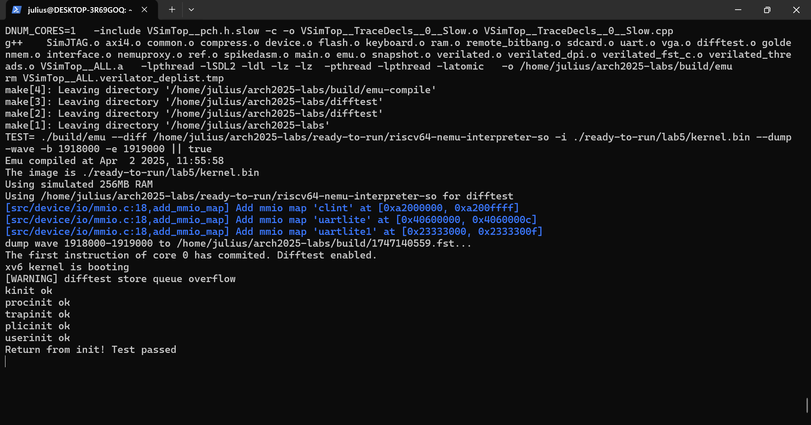
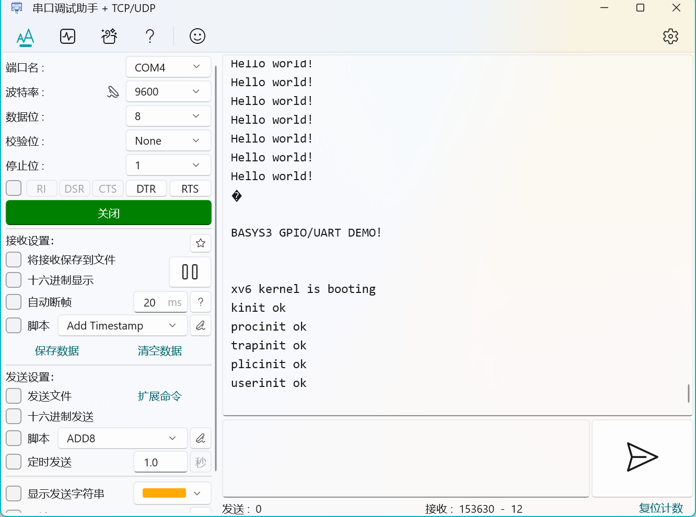
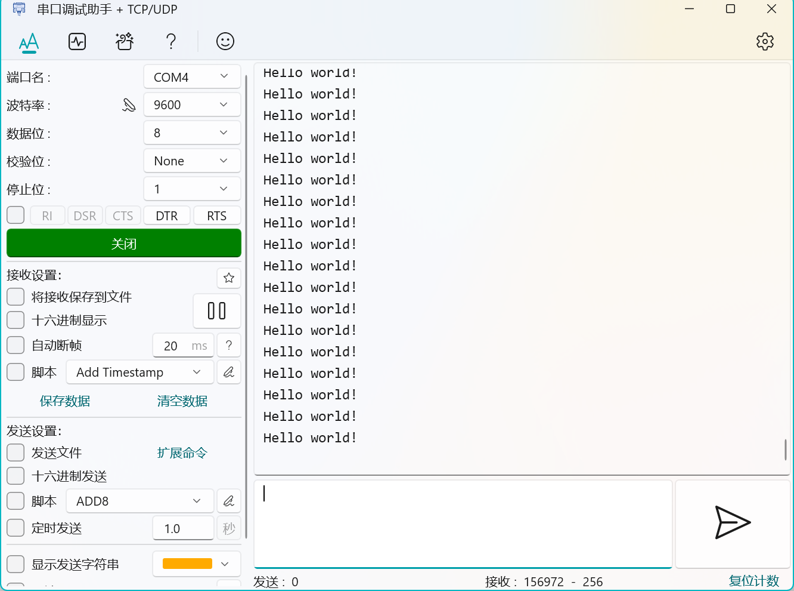
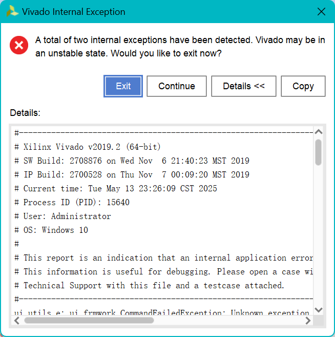

# Arch-2025-Lab5 实验报告

## 特权模式切换和MMU实验

### 23307130064 周弈成

## 内容简介

在根据五级流水线框架构成的、实现了完整的运算、访存、分支指令与控制状态寄存器的流水线CPU的基础上，实现通过指令进行的特权模式切换，且实现内存管理单元（MMU），在用户模式下使用三级页表，通过虚拟地址访问内存。实现的功能有：

* 特权模式切换指令：ECALL、MRET；
* 内存管理单元。

## 实验结果

能够通过lab5的所有Verilator测试，显示“Return from init! Test passed”。

* 测试结果

能够通过lab5的部分上板测试，输出“Hello world!”，但随后进入死循环。

* 准备结果
* Hello world
* 死循环

## 文件结构变化

`/util`文件夹内文件结构有变化：

* 添加内存管理模块`/MMU.sv`，接收内存请求并进行三级页表访存映射，转化为物理地址。

此外，修改下列文件：

* `/util/CBusArbiter.sv`：仲裁器接入内存管理模块；
* `/SimTop.sv`、`/VTop.sv`：增添由核心到仲裁器的基址CSR寄存器和特权模式接口；
* `/src/core.sv`：实现特权模式寄存器，增添基址CSR寄存器和特权模式输出接口；
* `/include/pipes.sv`：增添特权模式切换指令所需CSR寄存器的打包类型；
* `/pipeline/fetch/decoder.sv`：增添特权模式切换指令解码；
* `/pipeline/decode/decode.sv`、`/pipeline/decode/csrfile.sv`：增添专门读取多个特权模式切换指令所需CSR寄存器的读写接口，在相应条件下启用，相应修改数据类型；
* `/pipeline/execute/execute.sv`：添加特权模式切换时的CSR寄存器和特权模式赋值；
* `/pipeline/memory/memory.sv`、`/pipeline/writeback/writeback.sv`：添加特权模式切换时的CSR寄存器输出，和切换前的旧特权模式输出。

## 内存管理单元实现

首先，确定模块位置：

* 由于用户模式下的指令访存和数据访存**都**需要虚拟地址到物理地址的转换，所以为了逻辑简洁，**不应为两种访存分别设计内存管理模块**；
* 两种功能访存有统一总线，通过**仲裁器模块**实现切换；
* 因此，**内存管理模块应接入仲裁器模块**。

然后，由于内存管理模块需要实现**三级页表**，所以需要实现状态机。
状态机分为五个状态：

* 空闲状态：等待访存请求开始，时刻保存原请求输入备用；
* 一级页表状态：接收一级页表地址，进行一级页表访存，将结果映射到二级页表地址，确认访存完毕后进入下一状态；
* 二级页表状态：接收二级页表地址，进行二级页表访存，将结果映射到三级页表地址，确认访存完毕后进入下一状态；
* 三级页表状态：接收三级页表地址，进行三级页表访存，将结果映射到物理地址，确认访存完毕后进入下一状态；
* 完成状态：完成映射，调取原请求并替换地址为物理地址。

每一状态都需要发送内存请求并等待响应结果，通过设置输出的请求实现。把完成状态的请求结果同步到输入MMU的仲裁器结果。
注意在机器模式下不启用MMU，此时始终保持空闲状态；空闲状态下，若有访存请求且不启用MMU，直接同步原请求与结果。

## 特权切换指令实现

拆分成以下步骤：

* 解码：在取指阶段的解码器中判断指令，直接设置相应的控制信号；
* 取CSR：译码阶段，若为特权切换指令，需要取出原有mstatus寄存器内容；
* 替换CSR：执行阶段中，把CSR值和模式值根据公式相应更新，先在流水线寄存器暂存，写回阶段中更新。

由于一次需要取出/写回多个CSR，需要做特殊处理：

* 由于ecall和mret都需要额外取出mstatus，额外设置取出mstatus的指令接口，而将各自所需的另一CSR寄存器作为常规输入取出；
* 对于一次性写回的多个CSR值，设计新的结构体储存在流水线寄存器中，跟随进入译码阶段模块的写回部分。

实现以上功能后，能够通过lab5的Verilator测试。

## Vivado调试过程&求情

一开始时，上板至准备后，不会有任何后续输出。

Vivado中调取仿真，发现由于请求和响应的valid值不会像Verilator一样在一周期后立即清除，因而在下一状态中，需要**等待上一状态的响应值清除**后再进入判断访存值的状态。
为此，额外设置等待状态清除后再转换的另一状态机，根据两状态机值进行判断，从而可以在上板时输出“Hello World!”。

但是输出后仍然会进入死循环，不会输出Test Passed。

以下是本人电脑配置，仿真实在不易，达到32ms左右才执行第一次Mode切换，需要跑10分钟左右，随后的过程更加慢，并且由于Vivado软件内部原因，常常报错，报错后无法正常查看波形图，无法正常完成实验调试，望助教和老师理解。

* 处理器：Intel(R) Core(TM) i5-1035G1 CPU @ 1.00GHz   1.19 GHz
* 机带RAM：16.0 GB (15.8 GB 可用)
* Vivado报错
