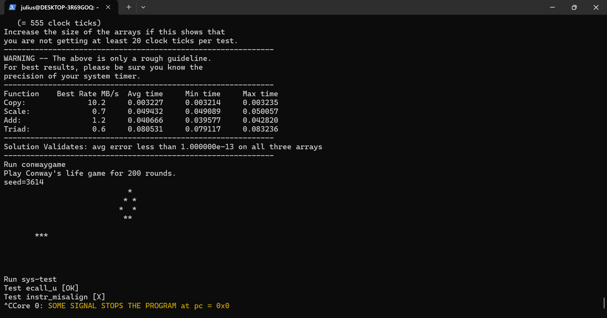

# Arch-2025-Lab+ 实验报告

## 进阶优化

### 23307130064 周弈成

## 内容简介

在根据五级流水线框架构成的、实现了完整的运算、访存、分支指令与控制状态寄存器以及MMU、中断和异常的流水线CPU的基础上，实现附加功能。实现的功能有：

* 乘除法：mul div divu rem remu mulw divw divuw remw remuw
* 物理内存保护（PMP）

## 实验结果

能够正常通过乘除指令测试，显示HIT GOOD TRAP。

可以通过PMP测试的前半CPU部分，无法通过测试的后半misalign。

## 乘除法器实现

为便于后续计算使用，我们采用systemverilog的function功能实现乘除运算。实现了64位乘法、32位乘法、64位除法及32位除法的函数。

我们通过类似列竖式的方式实现了二进制乘法：“被乘数”每个对应1的位数都加上“乘数”的左移对应位的结果，就是我们要求的乘法结果。

由于是二进制运算，除法则通过减法实现：一位位左移被除数，直到当前值大于除数就减掉并记录为商，最后剩余的数记录为余数，就是我们的除法结果。

通过函数参数，我们可以指定除法的取商或取余数，以及除法是否带符号。

对于W类型运算，我们分割为32位后单独处理然后拼接。

由于只涉及最多64次加减法和比较大小，可以直接在执行阶段的ALU中新增模块实现，周期数不会增加，无需改变流水线流程或阻塞流水线。

# PMP实现

PMP内存保护模块位于和MMU内存管理单元相似的位置，接入在仲裁器上。内存保护可以阻断一些非法的内存读取，起到保护的作用。

我们把原从MMU出来的请求和响应对接到PMP模块，从PMP模块中再对接输出的请求；同时，把CSR中的pmpaddr0和pmpcfg0寄存器接入到仲裁器。

根据pmpcfg的A位，我们确定采用何种计算PMP保护空间的算法，得出我们的访存地址是否需要确认读写权限；然后根据模式和L位判别是否启用保护；最后根据W位和R位，以及访存请求的读写状态确定是否有读或写的冲突，若有冲突则阻止访存请求（页错误暂时未实现）。
