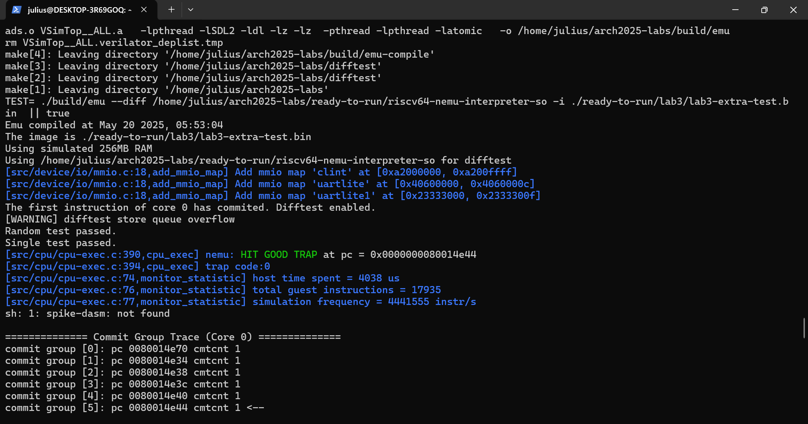

# Arch-2025-Lab+ 实验报告

## 进阶优化

### 23307130064 周弈成

## 内容简介

在根据五级流水线框架构成的、实现了完整的运算、访存、分支指令与控制状态寄存器以及MMU、中断和异常的流水线CPU的基础上，实现附加功能。实现的功能有：

* 乘除法指令：

## 实验结果

能够正常通过乘除指令测试，显示HIT GOOD TRAP。

## 乘除法器实现

乘法通过加法

